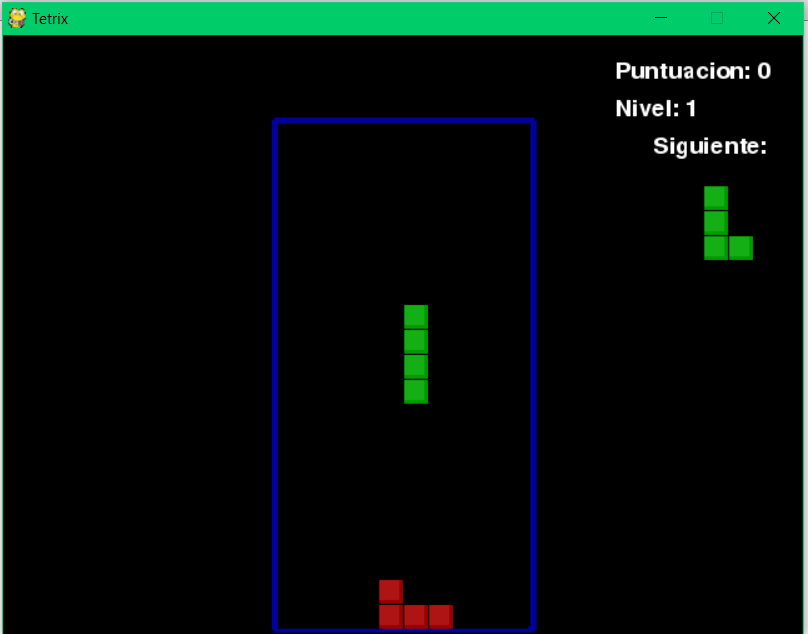

Tetrix es un clon de Tetris, escogimos el nombre de Tetrix porqué nos pareció único y orginal
=============================================================================================

El juego se ve algo así

Sin embargo, el juego no está terminado, se planean agregar ciertas cosas entre
las cuales están:

\>Conexión a bases de datos para llevar a cabo la programación de las siguientes
características

\* Creación de cuentas de usuario -\>

1.  En donde se liga un score y una lista de amigos

2.  El score es público, y los score de la lista de amigos se muestran

Características anexadas a pygame

1.  Ghost piece

2.  Hold piece
